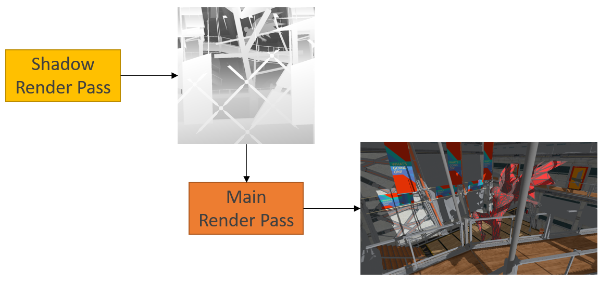
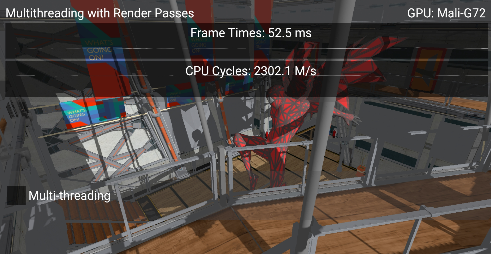
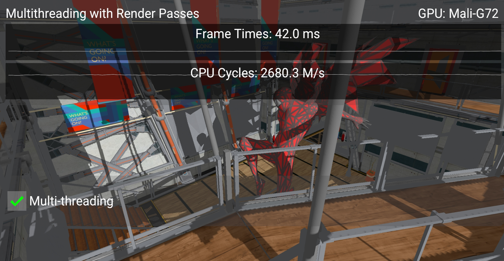
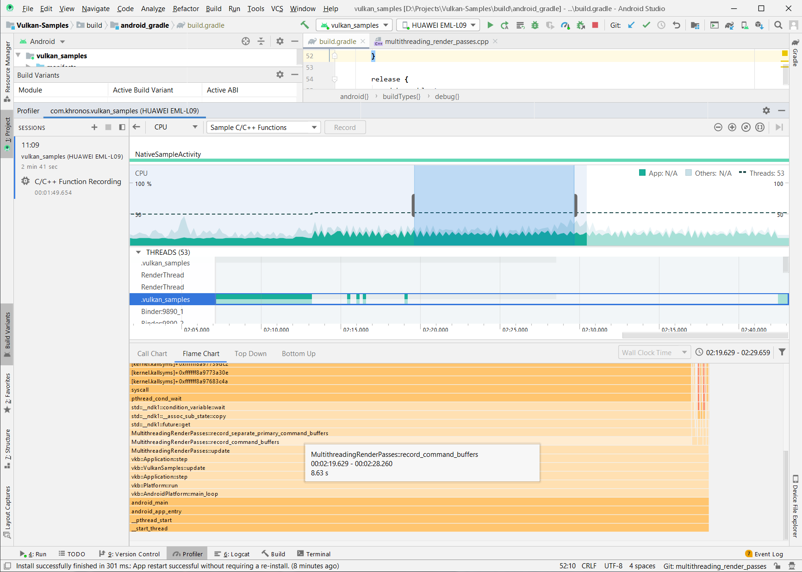

<!--
- Copyright (c) 2020, Arm Limited and Contributors
-
- SPDX-License-Identifier: Apache-2.0
-
- Licensed under the Apache License, Version 2.0 the "License";
- you may not use this file except in compliance with the License.
- You may obtain a copy of the License at
-
-     http://www.apache.org/licenses/LICENSE-2.0
-
- Unless required by applicable law or agreed to in writing, software
- distributed under the License is distributed on an "AS IS" BASIS,
- WITHOUT WARRANTIES OR CONDITIONS OF ANY KIND, either express or implied.
- See the License for the specific language governing permissions and
- limitations under the License.
-
-->

# Multi-threaded recording with multiple render passes

## Overview

In some cases multiple stages of frame rendering can't be performed in a single render pass. This sample shows how multi-threading can help to boost performance when using multiple render passes to render a single frame. 

## Using multiple render passes

 This sample uses two render passes to implement a technique called shadowmapping. 

 The first render pass is used to render a shadowmap. It contains only depth values and represents the scene as viewed from the light position.

 The second pass renders the actual scene from the camera point of view and uses the shadowmap from the previous pass. When light calculation is performed in fragment shader the depth value from shadow map is used to determine whether the fragment is ocludded (and therefore is in shadow) or not.

 The diagram below shows this two step process:

 Note that there is a dependency because the second pass uses the output of the first. Since these are two separate render passes we cannot use a ``VkSubpassDependency`` for synchronization. Instead ``VkImageMemoryBarrier`` is used.

## The Multi-threading Render Passes Sample

Given two or more render passes we can record them separately in multiple threads. 

Note that in order to achieve a good improvement the workload must be similiar for all the passes so that all the threads receive equal amounts of work. In this sample the same scene is rendered once for each render pass but from different view points. 

The way to use multi-threading with multiple render passes is to create a separate primary level command buffer for each of them. In this case command buffers can be recorded independently and then submitted to the queue all at once using ``vkQueueSubmit``.

When using this method for multi-threading, general recommendations should be taken into account (see [Multi-threaded-recording](https://github.com/KhronosGroup/Vulkan-Samples/blob/master/samples/performance/command_buffer_usage/command_buffer_usage_tutorial.md#Multi-threaded-recording)).

This sample shows the difference between recording both render passes into a single command buffer in one thread and using the method described above.

Below are screenshots of the sample running on a phone with a Mali G72 GPU:

Using two threads gives a 10.5ms frame time improvement and CPU cycles show an increase in CPU utilization:

[Android Profiler](https://developer.android.com/studio/profile/android-profiler) can be useful to see if the process of command buffers recording takes a significant part of frame time (and therefore frame time can be noticeably reduced by multi-threading this process).

_Android Profiler capture_

In this particular case application is CPU bound and multi-threading shows a good performance increase. The table below compares total time and impact of the function which records command buffers.

Mode | Commands recording time (ms) | Contribution
---|---|---
No multi-threading | 9.85 | 98.2 %
Multi-threading | 8.63 | 86 %

_Total capture duration is 10.03ms in both cases_

## Further reading

[Command buffer usage and multi-threaded recording](../command_buffer_usage/command_buffer_usage_tutorial.md)

## Best practice summary

**Do**

* Use multi-threading for command buffer recording if possible.

**Avoid**

* Avoid having a separate thread for each renderpass if their workloads are significantly different.

**Impact**

* The impact highly depends on the size of the scene and complexity of drawing commands recording.

**Debugging**

* Measure CPU time or overall time for each frame and compare results of using single and multiple threads.