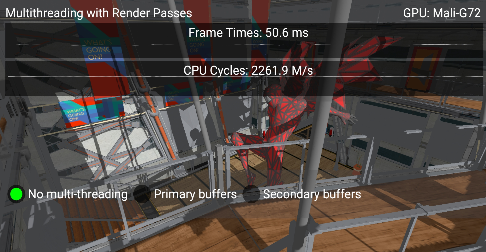
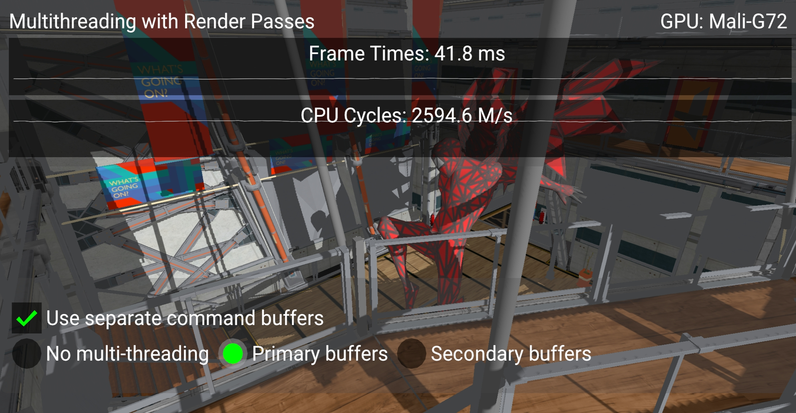
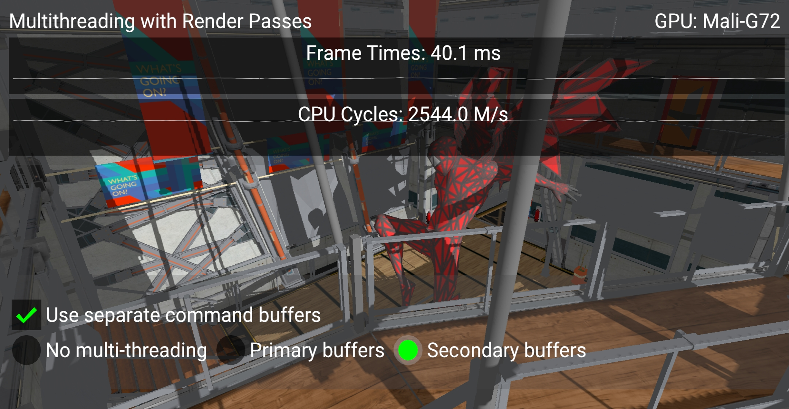

<!--
- Copyright (c) 2020, Arm Limited and Contributors
-
- SPDX-License-Identifier: Apache-2.0
-
- Licensed under the Apache License, Version 2.0 the "License";
- you may not use this file except in compliance with the License.
- You may obtain a copy of the License at
-
-     http://www.apache.org/licenses/LICENSE-2.0
-
- Unless required by applicable law or agreed to in writing, software
- distributed under the License is distributed on an "AS IS" BASIS,
- WITHOUT WARRANTIES OR CONDITIONS OF ANY KIND, either express or implied.
- See the License for the specific language governing permissions and
- limitations under the License.
-
-->

# Multi-threaded recording with multiple render passes

## Overview

In some cases multiple stages of frame rendering can't be performed in a single render pass. This sample shows how multi-threading can help to boost performance when using multiple render passes to render a single frame. 

## The Multi-threading Render Passes Sample

Given two or more render passes we can record them separately in multiple threads. 

Note that in order to achieve a good improvement the workload must be similiar for all the passes so that all the threads receive equal amounts of work. In this sample the same scene is rendered once for each render pass but from different view points. 

One way to use multi-threading is to create a separate primary level command buffer for each render pass. In this case command buffers can be recorded independently and then submitted to the queue all at once using ``vkQueueSubmit``.

This however adds a little overhead. In order to improve it we can use secondary level command buffers instead. This requires to follow the following rules (according to the Vulkan Spec):
* [Each element of pCommandBuffers must be in the pending or executable state](https://www.khronos.org/registry/vulkan/specs/1.2/man/html/vkCmdExecuteCommands.html)
* [commandBuffer must be a primary VkCommandBuffer](https://www.khronos.org/registry/vulkan/specs/1.2/man/html/vkCmdBeginRenderPass.html)

The way to achieve this is to record all the secondary command buffers in multiple threads, then start recording the primary command buffer. Inside of each render pass a secondary command buffer is specified using ``vkCmdExecuteCommands``.

When using any of these methods for multi-threading general recommendations should be taken into account (see [Multi-threaded-recording](https://github.com/KhronosGroup/Vulkan-Samples/blob/master/samples/performance/command_buffer_usage/command_buffer_usage_tutorial.md#Multi-threaded-recording)).

This sample compares different approaches of recording multiple render passes. It has two renderpasses: the first is used to render a shadowmap and the second one renders the actual scene using the result of the previous pass.

If "Use separate command buffers" checkbox is disabled all the commands are recorded into a single command buffer. Enabling it while using only a single thread shows no visible difference in frame rate.

When separate command buffers are used the multi-threading strategy can be chosen between "Primary buffers" and "Secondary buffers" to enable one of the approaches described above.

Below are screenshots of the sample running on a phone with a Mali G72 GPU:

Using two threads gives a 10ms improvement:

And using secondary command buffers helps to reduce frame time by 4%:

## Best practice summary

**Do**

* Use secondary level command buffers instead of submitting multiple primary command buffers per frame.

**Don't**

* Use a separate thread for each renderpass if their workloads are significantly different.

**Impact**

* The impact highly depends on the size of the scene and complexity of drawing commands recording.

**Debugging**

* Measure CPU time or overall time for each frame and compare results of using single and multiple threads.